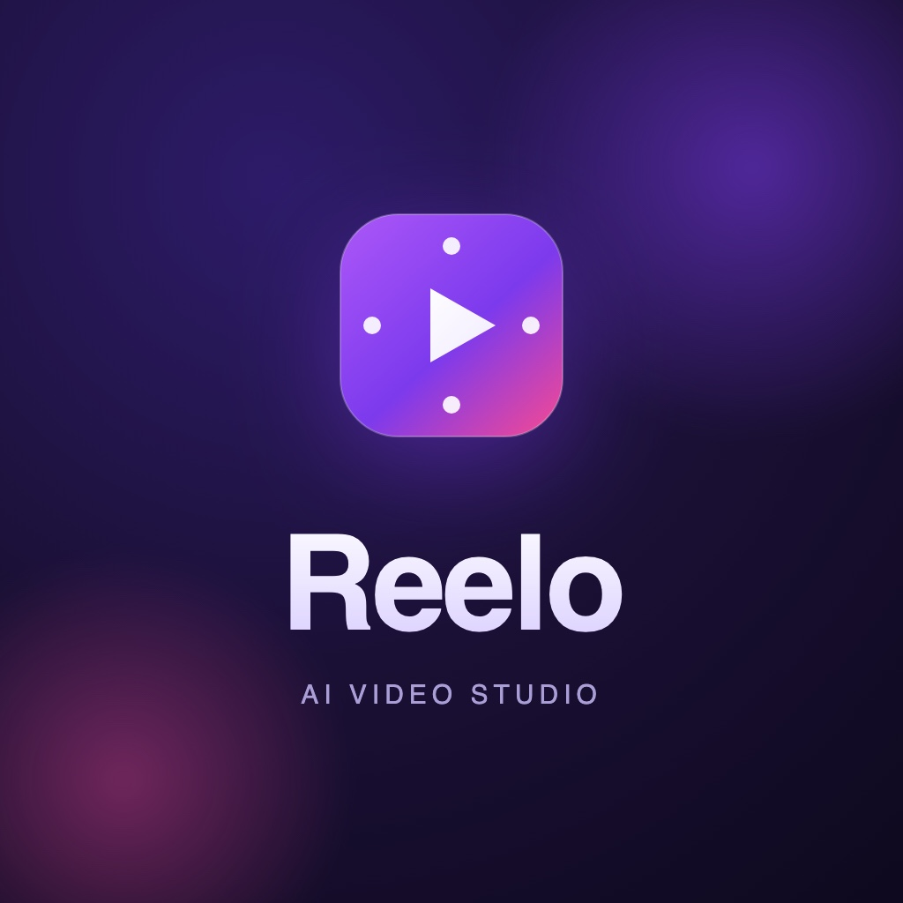

<p align="center">
  
</p>

<h1 align="center">Reelo — AI Video Studio</h1>

<p align="center">
  <em>Prompt → AI-generated video → auto-published to Facebook, Instagram, YouTube & TikTok.</em>
</p>

<p align="center">
  <a href="#">Live demo</a> · <a href="#">2-min walkthrough</a> · <a href="#">Source</a>
  <br><sub>Live demo runs in <strong>demo mode</strong> (sample generations) — see “Running it safely” below.</sub>
</p>

---

## TL;DR

Reelo is a full-stack, multi-platform product that turns a text prompt into a short
video and publishes it to a creator's social accounts. I built it end-to-end: a
TypeScript API, a React web app, and a React Native mobile app — **~21,700 lines of
production TypeScript** across three apps, **125 test files**, wired to real
third-party services (OpenAI Sora, Kling, Cloudinary, Meta/YouTube/TikTok OAuth,
Stripe) that each **degrade gracefully to a local stub** when credentials are absent.

| | |
|---|---|
| **Role** | Sole engineer — architecture, backend, web, mobile, infra |
| **Scale** | 3 apps · 6 feature modules each · ~21.7k LOC · 125 test files |
| **Backend** | Node 20 · TypeScript (strict) · Express · MongoDB · Redis |
| **Web** | React · TanStack Query · Zustand · Tailwind · Vite |
| **Mobile** | React Native · Expo Router · NativeWind |
| **Integrations** | OpenAI Sora · Kling · Cloudinary · Google/Meta/TikTok OAuth · Stripe |
| **Infra** | Docker Compose · nginx load balancer · horizontal scaling · CI per app |

---

## The problem

Independent creators want short-form video but face two frictions: producing the clip,
and the tedious, per-platform ritual of publishing it (different auth, different upload
APIs, different rules). Reelo collapses that into one flow — **describe it, generate it,
publish everywhere** — while handling the unglamorous parts that make such a product
real: authentication, encrypted OAuth token storage, credit-based billing, rate
limiting, and multi-tenant safety.

The engineering goal I set myself: build it like a product that has to survive
contact with real users and real money, not a demo.

---

## Architecture

The backend is a **modular monolith on onion architecture**. Each feature
(`auth`, `video`, `connections`, `publishing`, `analytics`, `billing`) is a
self-contained module with four layers, and dependencies only ever point inward:

```
modules/<feature>/
  domain/          entities, value objects, ports (interfaces), domain errors — zero framework imports
  application/     use cases (one class, one execute()) orchestrating the domain through ports
  infrastructure/  concrete adapters implementing the ports (Mongo, Redis, bcrypt, JWT, Cloudinary…)
  presentation/    Express controllers, routers, validators, guards
  <feature>.module.ts   composition root — wires adapters → use cases, returns a Router
```

The web and mobile apps mirror this with **MVVM**: a typed **Data** layer (API client +
TanStack Query keys) → **ViewModel** hooks (no JSX) → **Presentation** (React
components, no direct API calls). The mobile app is a near 1:1 port of the web app's
data and viewmodel layers, so business logic is written once and shared in spirit
across platforms.

### Why this mattered

- **The domain is testable in isolation.** Use cases depend on interfaces (`I`-prefixed
  ports), never on Mongo or an HTTP client — so ~73 server test files exercise real
  logic without spinning up infrastructure.
- **Adding an integration is a known, small move:** implement the port, add a credential
  check to the module wiring, fall back to the stub. TikTok publishing was added this way
  as a self-contained slice.

---

## Engineering decisions I'm proud of

### 1. Every integration is dual-mode — real adapter or free stub

Every external dependency sits behind a port. The real adapter activates **only when its
credentials are present in the environment**; otherwise a stub runs. That's what lets the
entire product — generate a video, connect an account, publish, get paid — run **locally
for free, with no API keys**, and lets me deploy a public demo that can't leak or burn a
real Sora key. The AI generator resolves `sora → kling → stub` in order of available
credentials.

> This single decision is why the app is both a serious integration and a safe portfolio
> piece: the same codebase runs in full-fidelity production and in zero-cost demo mode.

### 2. Refresh-token rotation with reuse detection

Refresh tokens are single-use and rotated within a "family." A token that cryptographically
verifies but is **absent from Redis** is treated as a replay — and the **entire token family
is revoked**, logging out a compromised session everywhere. This is the kind of detail that
separates "I used JWTs" from "I thought about what happens when one is stolen."

### 3. Credits that can't be oversold

Billing runs on a credit ledger. Debits use a conditional `$inc` (`balance >= amount`) so
concurrent requests can never overdraw the account. Charges happen on video creation (a
`402` if funds are short) and are **refunded automatically if generation fails**. Where a
MongoDB replica set is available, the debit flow uses a multi-document transaction; on a
standalone Mongo it falls back to non-transactional writes so local dev still works.

### 4. OAuth tokens encrypted at rest, auto-refreshed, never returned

Social connection tokens are encrypted with **AES-256-GCM** before storage, transparently
refreshed before use, and never sent back to any client. Connections that can no longer be
refreshed flip to an `expired` state the UI can act on.

### 5. Stateless, horizontally scalable by construction

Sessions and rate limits live in Redis, so API replicas hold no local state. `docker
compose up --scale server=3` puts three instances behind an nginx load balancer on a single
public port; every response carries an `X-Instance-Id` header for tracing which replica
served it. Rate limiting is a Redis-backed fixed-window behind an `IRateLimiter` port, so
limits hold **across** replicas, not per-process.

### 6. One consistent wire contract, enforced by construction

Every success response is `{ success: true, data }`, built field-by-field by a per-module
**presenter** — controllers never forward a use-case result wholesale, so a growing internal
DTO can't silently leak new fields onto the wire. Errors are `AppError` subclasses mapped to
status/code by a single global handler; clients unwrap `data` centrally so the data layer
stays envelope-free.

### 7. Streaming uploads with back-pressure

User video uploads stream through **busboy** with an enforced 500 MB cap, MIME allow-list,
and a hard limit of 5 concurrent in-process uploads — then land in Cloudinary with
`public_id = key` so re-uploads are idempotent. No buffering an entire file to disk, no
unbounded concurrency.

---

## Testing & quality

- **125 test files** across the three apps (server 73, web 42, mobile 10).
- Server tests are layered: **unit** (pure logic, no I/O) → **integration** (real Mongo via
  `mongodb-memory-server` + Redis via `ioredis-mock`) → **e2e** (the assembled app driven
  through supertest). Tests inject fakes into the composition root, so production singletons
  are never touched.
- Web viewmodels are tested with Vitest + React Testing Library, with **MSW** mocking HTTP;
  Playwright covers e2e against a mocked API.
- **Strict TypeScript everywhere** — `noUncheckedIndexedAccess`, `exactOptionalPropertyTypes`,
  `noUnusedLocals/Parameters`.
- **CI (GitHub Actions), path-filtered per app:** format → lint → typecheck → test (coverage)
  → build. A change to one app doesn't run the other two's pipelines.

---

## Running it safely (the demo-mode story)

The public demo runs **without any AI or payment keys**, so every external call resolves to a
stub: real prompt-to-publish flow, sample video output, no cost, nothing to leak. The
architecture guarantees secrets are server-side only — the web bundle's environment contains
just the API URL and a *public* Google client ID, so there was never a client-side key to
expose. For the walkthrough video, I run the same build locally with a real Sora key to show
genuine AI generation.

---

## Tech stack

**Backend** — Node 20, TypeScript (strict), Express, MongoDB/Mongoose, Redis/ioredis, Zod,
JWT, bcrypt, Cloudinary, Stripe, pino. <br>
**Web** — React, React Router, TanStack Query, Zustand, Tailwind, Framer Motion, Vite,
Vitest, Playwright, MSW. <br>
**Mobile** — React Native, Expo Router, NativeWind, TanStack Query, `expo-secure-store`,
`expo-video`, Jest. <br>
**Infra** — Docker Compose, nginx, MongoDB replica set, GitHub Actions.

---

## What I'd build next

- **Real background job queue** for generation + scheduled publishing (currently a scheduler
  endpoint guarded by a shared secret) — move to BullMQ with retries and dead-lettering.
- **Observability** — structured metrics + tracing beyond the per-instance header, wired to a
  dashboard.
- **Webhook-driven generation status** hardened with idempotency keys end-to-end.
- **Shared TS package** to physically dedupe the web/mobile data + viewmodel layers rather
  than mirroring them.

---

<p align="center"><sub>Built end-to-end by Michael Olotu. Architecture, code, and infra are my own.</sub></p>
